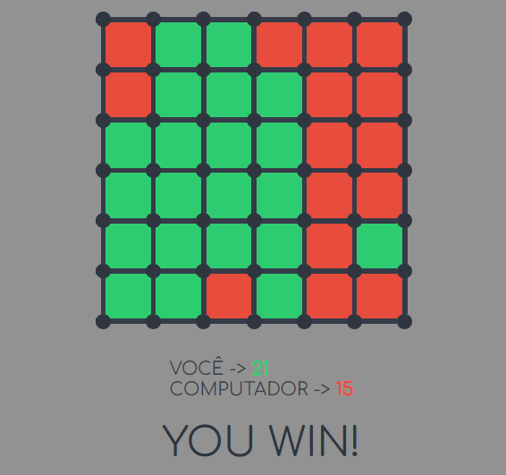

# JOGO DOS PONTINHOS
👨‍🏫ESTE JOGO É UMA VERSÃO DIGITALIZADA DE UM JOGO DE CONECTAR PONTOS E FORMAR QUADRADOS, ONDE O JOGADOR COMPETE CONTRA UM OPONENTE CONTROLADO POR IA.

  

## DESCRIÇÃO:
Este é um jogo de tabuleiro baseado na criação de conexões entre pontos em uma grade, semelhante ao jogo "Pontos e Quadrados" (ou "Dots and Boxes"). 

## OBJETIVO:
O jogo envolve dois jogadores (você e o computador) que tomam turnos para conectar pontos adjacentes em uma grade 7x7 (ou outra dimensão configurável). O objetivo é conectar pontos de forma a formar quadrados fechados. O jogador que completar um quadrado ganha pontos, e o jogo termina quando todas as áreas possíveis forem preenchidas.

## REGRAS:
1. **Grade e Posição dos Pontos**: O tabuleiro é representado por uma matriz, onde cada célula da matriz contém um ponto (dot), com coordenadas geradas e armazenadas na função `generateGameData`. Esses pontos são dispostos na tela e podem ser clicados para gerar conexões entre eles.
   
2. **Conexões entre Pontos**: A cada turno, o jogador seleciona dois pontos adjacentes para conectá-los. O código renderiza as conexões visíveis com a função `renderConnection`. Cada conexão pode ser feita entre pontos adjacentes na vertical ou horizontal (direções: cima, baixo, esquerda e direita).

3. **Formação de Quadrados**: O objetivo é fechar quadrados (áreas 1x1) conectando quatro lados de um quadrado, o que é gerenciado pela função `setScores`. Quando um quadrado é formado, o jogador que o completou recebe um ponto. Cada quadrante de um ponto verifica se as quatro arestas necessárias estão conectadas (`getQuadrantPathStatus`).

4. **Turnos e IA (Computador)**: 
   - O jogador humano faz uma jogada clicando em dois pontos conectáveis. Após a jogada, o jogo verifica se um quadrado foi fechado.
   - Se o jogador não formar um quadrado, o turno passa para o computador.
   - A jogada do computador é controlada pela função `computerChoice`, que busca as melhores opções de movimento, priorizando as conexões que podem levar a formar quadrados.

5. **Pontuação**: A cada vez que um quadrado é completado, o jogador correspondente ganha um ponto. O jogo continua até que todas as áreas possíveis tenham sido preenchidas (determinado por `totalGameSquares`). O jogador com a maior pontuação no final vence.

6. **Fim de Jogo**: Quando todas as conexões possíveis foram feitas e todos os quadrados foram preenchidos, o jogo termina. Se o jogador humano tiver mais quadrados fechados, ele vence, caso contrário, o computador vence. Em caso de empate, o jogo exibe uma mensagem de "Empate".

## INTERAÇÕES VISUAIS:
- **Renderização do Tabuleiro**: A função `renderGameBoard` cuida de desenhar os pontos e as conexões no tabuleiro. 
- **Movimentos**: O jogador clica em dois pontos para formar uma conexão. O computador toma decisões com base nas possíveis jogadas restantes.

## ESTRATÉGIA DO COMPUTADOR:
O computador escolhe suas jogadas de acordo com um sistema de "melhores caminhos" (`bestPath`). Ele prioriza jogadas que possam fechar quadrados com o menor número de movimentos. Se não puder fechar um quadrado, escolhe conexões aleatórias para se preparar para futuras jogadas.

## CARACTERISTICAS ADICIONAIS:
- **Combo (Streak)**: Se o jogador fechar mais de um quadrado consecutivamente, a interface mostra uma mensagem de "STREAK!!!" e o número de quadrados consecutivos.

## O COMPUTADOR É UMA IA?
### O QUE É UMA IA?
Uma inteligência artificial (IA) verdadeira é um sistema que pode aprender, adaptar-se e melhorar seu desempenho ao longo do tempo com base em experiências passadas. Esse tipo de IA geralmente usa algoritmos de aprendizado de máquina, como redes neurais ou algoritmos de aprendizado por reforço, que analisam grandes quantidades de dados para identificar padrões e tomar decisões informadas.

### POR QUE O COMPUTADOR NÃO É UMA IA VERDADEIRA?
1. **Lógica Estática**:
   - O código é baseado em regras e lógicas fixas. As jogadas são definidas por condições estáticas (como escolher a primeira casa livre ou a casa aleatória) que não mudam com o tempo ou com a experiência. Não há aprendizado ou adaptação às estratégias do jogador.

2. **Falta de Aprendizado**:
   - O código não coleta ou analisa dados sobre suas partidas anteriores. Uma IA verdadeira seria capaz de armazenar informações sobre as jogadas do adversário e aprender a reconhecer padrões e estratégias, melhorando sua jogabilidade em partidas futuras. No código, cada partida é independente e não influencia as jogadas futuras.

3. **Decisões Baseadas em Algoritmos Simples**:
   - As decisões do "oponente" são baseadas em algoritmos simples e diretos. A IA que você vê no código apenas implementa uma lógica básica de jogo, como jogar em uma posição aleatória ou seguir uma estratégia fixa. Uma IA verdadeira, por outro lado, utilizaria algoritmos complexos que poderiam avaliar múltiplas possibilidades e resultados antes de decidir.

4. **Ausência de Feedback**:
   - Uma IA que aprende precisa de um sistema de feedback para avaliar o sucesso de suas ações e ajustar suas estratégias. O código não fornece nenhum mecanismo de feedback que permita ao "oponente" aprender com suas vitórias ou derrotas. As jogadas não são analisadas para determinar se foram eficazes ou não.
  
## NÃO SABE?
- Entendemos que para manipular arquivos em `HTML`, `CSS` e outras linguagens relacionadas, é necessário possuir conhecimento nessas áreas. Para auxiliar nesse aprendizado, oferecemos cursos gratuitos disponíveis:
* [CURSO DE HTML E CSS](https://github.com/VILHALVA/CURSO-DE-HTML-E-CSS)
* [CURSO DE JAVASCRIPT](https://github.com/VILHALVA/CURSO-DE-JAVASCRIPT)
* [CONFIRA MAIS CURSOS](https://github.com/VILHALVA?tab=repositories&q=+topic:CURSO)

## CREDITOS:
- [PROJETO CRIADO PELO "Maykerh"](https://github.com/Maykerh/pontinho)
- [PROJETO EDITADO PELO VILHALVA](https://github.com/VILHALVA)

